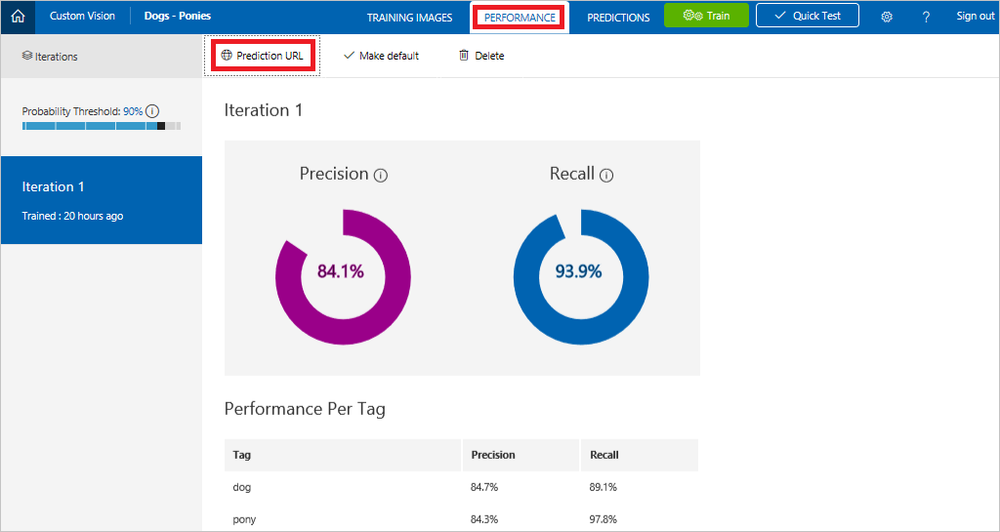

# 4. Introduction to Microsoft Custom Vision Service
## Introduction
This repo contains the Windows client library & sample for the Microsoft Custom Vision Service, an offering within [Microsoft Cognitive Services](https://www.microsoft.com/cognitive-services)

## The Prediction Client Library
The prediction client library is an automatically generated C\# wrapper that allows you to make predictions against trained endpoints.

The easiest way to get the prediction client library is to get the [Microsoft.Cognitive.CustomVision.Prediction](https://www.nuget.org/packages/Microsoft.Cognitive.CustomVision.Prediction/) package from [nuget](<http://nuget.org>). 

## The Training Client Library
The training client library is automatically generated C\# wrapper that allows you to create, manage and train Custom Vision projects programatically. All operations on the [website](<https://customvision.ai>) are exposed through this library, allowing you to automate all aspects of the Custom Vision Service.

The easiest way to get the training client library is to get the [Microsoft.Cognitive.CustomVision.Training](https://www.nuget.org/packages/Microsoft.Cognitive.CustomVision.Training/) package from [nuget](<http://nuget.org>).

## Learning Outcomes
* Understand Microsoft Custom Vision Service to an introductory level.
* Use Microsoft Custom Vision Service in your xamarin forms app.

We have used the Prediction Endpoint to Test Images Programmatically

## Step 1: Train your model

## Step 2: Obtain the prediction endpoint URL for a specific iteration:

1. Click the "PERFORMANCE" tab, which is shown inside a red rectangle in the following image.
2. In the left pane, click on the iteration you want to use for testing images.
3. In the upper part of the screen, click "Prediction URL", which is also shown in a red rectangle in the following image.



## Step 3: Test an image in C#

```csharp
using System.Diagnostics;
using System.IO;
using System.Net.Http;
using System.Net.Http.Headers;
using System.Threading.Tasks;
using Plugin.Media.Abstractions;
using Xamarin.Forms;

namespace NotHotdog
{
    public partial class ResultPage : ContentPage
    {
        public ResultPage(MediaFile file)
        {
            InitializeComponent();

			image.Source = ImageSource.FromStream(() =>
			{
				var stream = file.GetStream();
				file.Dispose();
				return stream;
			});

            // Call method to make prediction
            MakePredictionRequest(file);
        }

	    static byte[] GetImageAsByteArray(MediaFile file)
		{
            var stream = file.GetStream();
			BinaryReader binaryReader = new BinaryReader(stream);
			return binaryReader.ReadBytes((int)stream.Length);
		}

		static async Task MakePredictionRequest(MediaFile file)
		{
			var client = new HttpClient();

			// Request headers - replace this example key with your valid subscription key.
			client.DefaultRequestHeaders.Add("Prediction-Key", "a51ac8a57d4e4345ab0a48947a4a90ac");

			// Prediction URL - replace this example URL with your valid prediction URL.
			string url = "https://southcentralus.api.cognitive.microsoft.com/customvision/v1.0/Prediction/4da1555c-14ca-4aaf-af01-d6e1e97e5fa6/image?iterationId=7bc76035-3825-4643-917e-98f9d9f79b71";

			HttpResponseMessage response;

			// Request body. Try this sample with a locally stored image.
			byte[] byteData = GetImageAsByteArray(file);

			using (var content = new ByteArrayContent(byteData))
			{
				content.Headers.ContentType = new MediaTypeHeaderValue("application/octet-stream");
				response = await client.PostAsync(url, content);
				Debug.WriteLine(await response.Content.ReadAsStringAsync());
			}
		}
    }
}
```
## Resources
### Bootcamp Content
* [Slide Deck](http://link.com) (Will be up soon!)
* [Video](http://link.com) (Will be up soon!)

### Tools

### Extra Learning Resources
