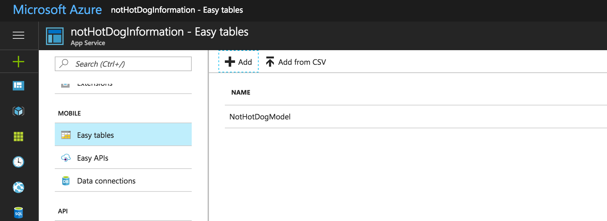
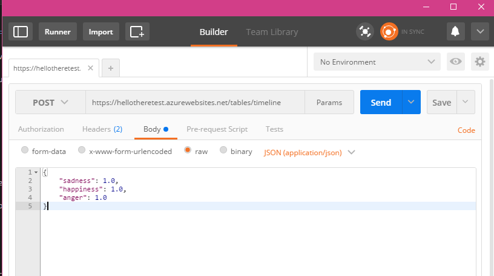

# 6.2 Creating an Azure Mobile App with Easy Tables

## Introduction
So now that we have a database attached to our backend server (mobile app), we now want our client application (xamarin application) to do GET and POST requests to the database.

As our server is hosted as a mobile app we could just use a HTTP request. However there exists a managed client SDK package for Mobile Apps (`Microsoft.Azure.Mobile.Client`) that we can use to work with our server. 

This similar interaction with mobile app can be done with native applications such as Android and iOS.
Here in this tutorial we can see that interacting with the backend is the same for Xamarin and Bot Framework as they are both in C#.

For full understanding of working with the backend please refer to the `2. Xamarin` as `3. Bot Framework` just references it.

The completed project of both the Xamarin and Bot are included in this folder.

### Important
For this tutorial make sure you have an easy table in your mobile backend called `timeline`, as we reference it by name 

## Resources
### Bootcamp Content
* [Video - Waiting](http://link.com)

## 1. Postman requests 
Lets first see how our data looks like by making a GET request to `https://MOBILE_APP_URL.azurewebsites.net/tables/timeline` (replace `MOBILE_APP_URL` with your server name, for this demo its "hellotheretest").
- /tables to access our easy tables
- `/timeline` is the specific table we want to make requests to, so in the server `https://hellotheretest.azurewebsites.net/` there is an easytable called `timeline`

NOTE: When we make requests to our backend thats hosted as a MOBILE_APP, we need to add the following header to our requests

GET Request and response (If yours doesnt show any data ie just `[]` that means nothing is in your table! Dont worry, later when we take photos, if we make another request we will see data)

Here we can see it matches well with whats in our current backend database (with data)

Now with a POST request, we want to add new information to the backend database
Because its easy tables, the schema is adjusted to what we send because it dynamically matches. So we can use any key and value pairings but to keep it consisent its normally better to keep to one schema rather than change it every 5 mins.

We will send a JSON request with happiness, sadness and anger values
(Note the body-content type is `raw` and of `JSON (application/json)` type)

Now we see that it has added the new entry to our database. 

NOTE: The other fields we didnt give values in our POST request (contempt, disgust ..) are defaulted to null values

### Extra Learning Resources
* [Using App Service with Xamarin by Microsoft](https://azure.microsoft.com/en-us/documentation/articles/app-service-mobile-dotnet-how-to-use-client-library/)
* [Using App Service with Xamarin by Xamarin - Outdated but good to understand](https://blog.xamarin.com/getting-started-azure-mobile-apps-easy-tables/)
* [ListView in Xamarin](https://developer.xamarin.com/guides/xamarin-forms/user-interface/listview/)